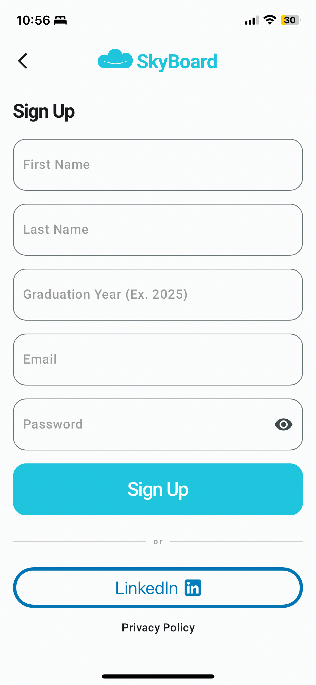
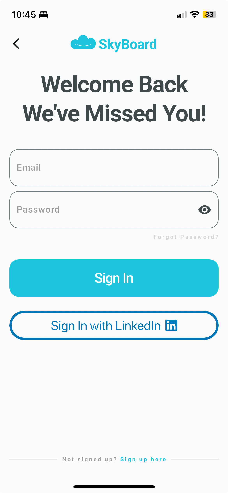
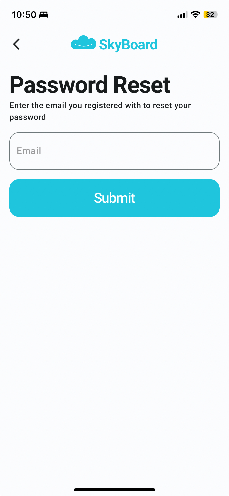
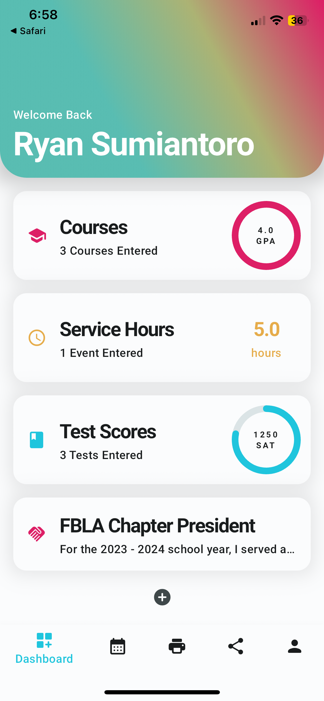
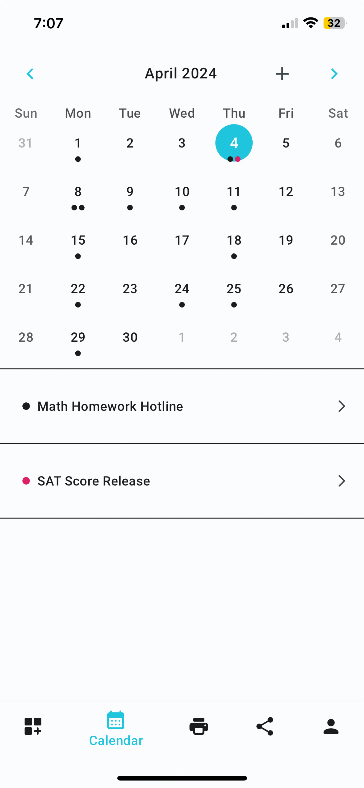
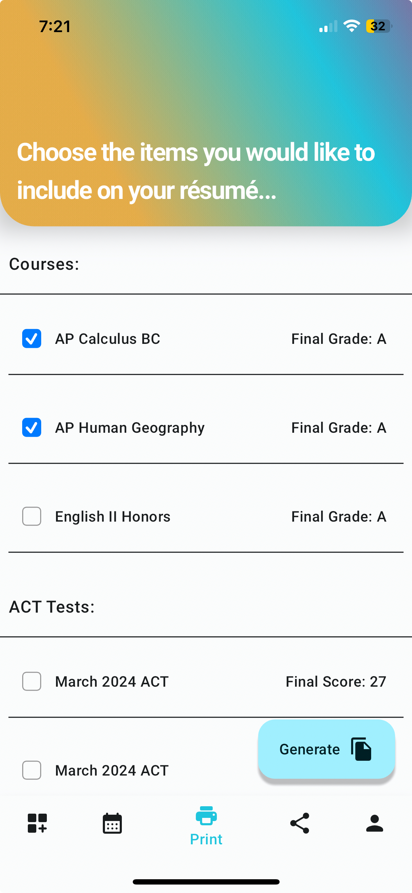
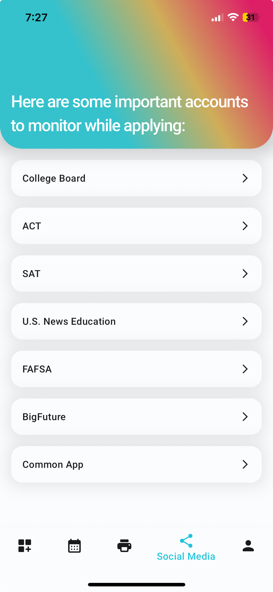
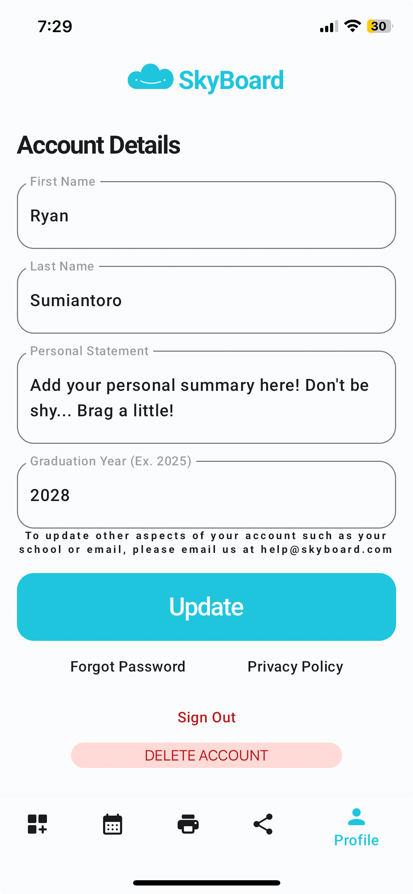

# Documentation

> Below is the documentation for our app SkyBoard. To easily navigate throughout the documentation, we recommend using the sidebar and its headings. As this app uses Flutter, it is cross platform for both Apple's iOS and Google's Android operating systems. This documentation applies for both operating systems.

> Facing a bug? Have a question or suggestion? [Contact Us](support.md)

## Sign Up

| When the user initially opens the app, they are shown a set of onboarding screens to describe the functionallity of SkyBoard. They can then tap "Sign Up" to sign up for the application. There are two options to sign up for the application: Email & Password or LinkedIn. LinkedIn is the recoomended option as it allows users to share posts to their LinkedIn accounts directly from our application. |  |
| ------------------------------------------------------------------------------------------------------------------------------------------------------------------------------------------------------------------------------------------------------------------------------------------------------------------------------------------------------------------------------------------------------------ | ---------------------------------------------------------- |

## Login

|  | There are two options to log into the application: Email & Password or LinkedIn. LinkedIn is the recoomended option as it allows users to share posts to their LinkedIn accounts directly from our application. If a user does not yet have an account, they can click "Sign Up Here" to navigate to the account creation screen. If a user wishes to delete their account, they can do so from the Accounts page once logged in. |
| ------------------------------------------------------ | --------------------------------------------------------------------------------------------------------------------------------------------------------------------------------------------------------------------------------------------------------------------------------------------------------------------------------------------------------------------------------------------------------------------------------- |

## Forgot Password

| In order to reset their password, a user must navigate to the forgot password screen from the login screen. To reset their password, a user must enter the email used in their account then hit “Send”. This will send a password reset email to the users inbox. Ensure you check your spam folder when searching for the email. |  |
| --------------------------------------------------------------------------------------------------------------------------------------------------------------------------------------------------------------------------------------------------------------------------------------------------------------------------------- | -------------------------------------------------------------------------- |

## Dashboard

|  | The landing page of the app is the dashboard screen. It provides quick access to your courses, service hours, tests scores, and custom events. By tapping on any of the tiles, you can see a detailed overview of each item. Tapping the "+" icon at the bottom of the screen allows you to add custom tiles like work experience, leadership positions, and more. |
| ------------------------------------------------------------- | ------------------------------------------------------------------------------------------------------------------------------------------------------------------------------------------------------------------------------------------------------------------------------------------------------------------------------------------------------------------ |

## Calendar

| The next page in our app is the calendar. To navigate to this page, simply tap the calendar icon in the bottom navigation bar. This will highlight that icon and bring up the screen. The calendar is sinked to Hillsborough County Public School's district calendar. You also have the ability to add your own events such as scholarship deadlines and college acceptance release dates. If you click on a day, the events for that day are brought up below the calendar. If you tap on an event, a detail view will be brought up for it. |  |
| ---------------------------------------------------------------------------------------------------------------------------------------------------------------------------------------------------------------------------------------------------------------------------------------------------------------------------------------------------------------------------------------------------------------------------------------------------------------------------------------------------------------------------------------------- | ------------------------------------------------------------ |

## Generating Resumes

|  | The next page in our app is the print screen. To navigate to this page, simply tap the print icon in the bottom navigation bar. This will highlight that icon and bring up the screen. This page allows you to print out a fully formatted resume. Simply select the elements you would like to include on the resume, then tap "Generate". This will open a pop-up window allowing you to print the newly generated resume or save it to your device. |
| ------------------------------------------------------ | ------------------------------------------------------------------------------------------------------------------------------------------------------------------------------------------------------------------------------------------------------------------------------------------------------------------------------------------------------------------------------------------------------------------------------------------------------ |

## X Quick Links

| The next page in our app is the social media screen. To navigate to this page, simply tap the social icon in the bottom navigation bar. This will highlight that icon and bring up the screen. This screen displays a list of useful X accounts such as the College Board, FAFSA, and more. These quick links help students stay updated on the everchanging college application scene |  |
| -------------------------------------------------------------------------------------------------------------------------------------------------------------------------------------------------------------------------------------------------------------------------------------------------------------------------------------------------------------------------------------- | ------------------------------------------------------- |

## Profile

|  | The next page in our app is the profile screen. To navigate to this page, simply tap the profile icon in the bottom navigation bar. This will highlight that icon and bring up the screen. This screen displays a the user's username, personal statement, graduation year, and buttons to change your password, report a bug, and sign out. To change your username, simply edit the text. |
| ---------------------------------------------------------- | ------------------------------------------------------------------------------------------------------------------------------------------------------------------------------------------------------------------------------------------------------------------------------------------------------------------------------------------------------------------------------------------- |
